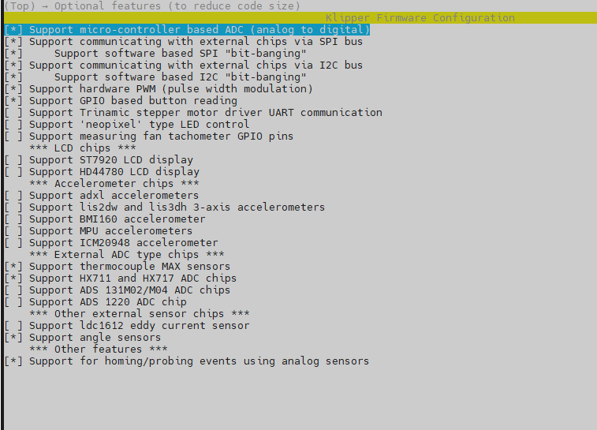

# Catalyst.K Leveling
## Introduction
Unlike Creality's official leveling MCU, this leveling MCU is used for the official open-source Klipper. Please consult the guide at https://www.klipper3d.org/Load_Cell.html and complete the calibration process before use.

## Firmware Configuration
Catalyst.K LevelingMCU uses the bootloader-free mode by default, and the configuration is as follows:
 
 

## Firmware Upload
Use the following commands to compile and upload the firmware.
```
cd ~/klipper
make flash FLASH_DEVICE=0483:df11
```


# Important
During normal operation, PA0, PA1, PA5, and PA6 should all be at a low logic level; please do not set them to a high logic level.