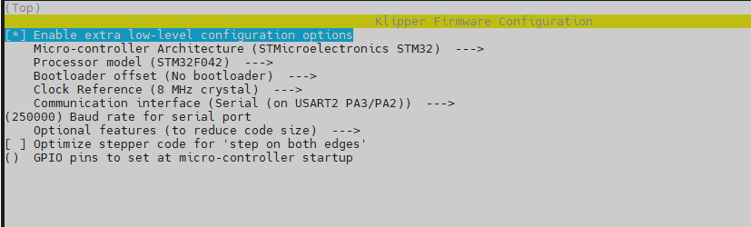

# Firmware Configuration
Catalyst.K LevelingMCU uses the bootloader-free mode by default, and the configuration is as follows:
 
 

# Firmware Upload
Use the following commands to compile and upload the firmware.
```
cd ~/klipper
make flash FLASH_DEVICE=0483:df11
```
