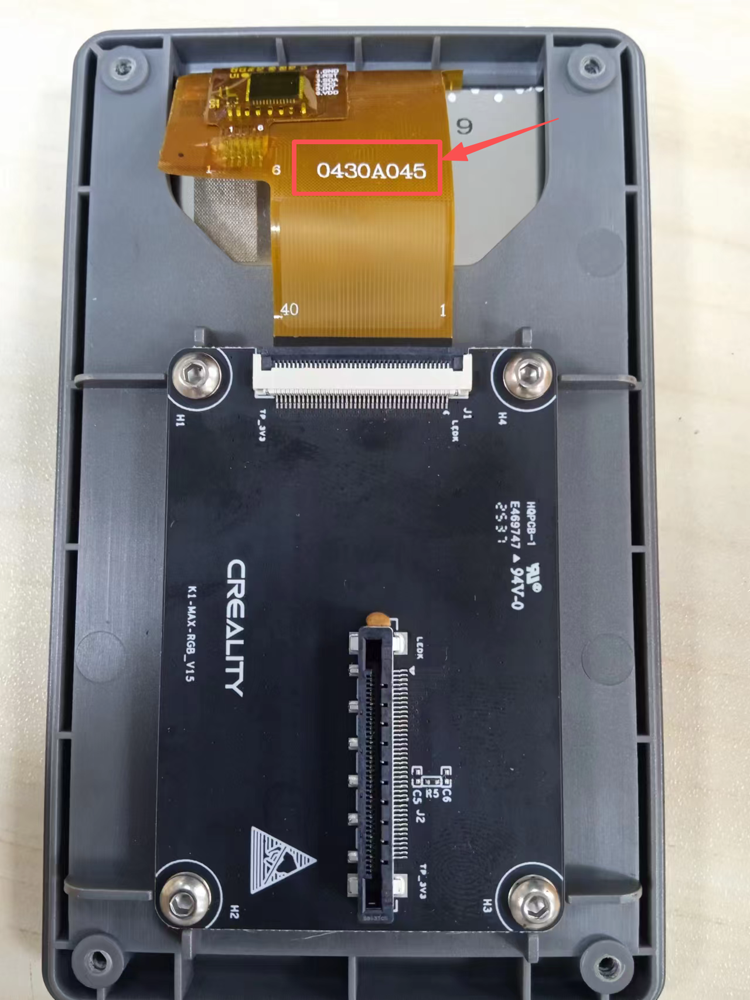
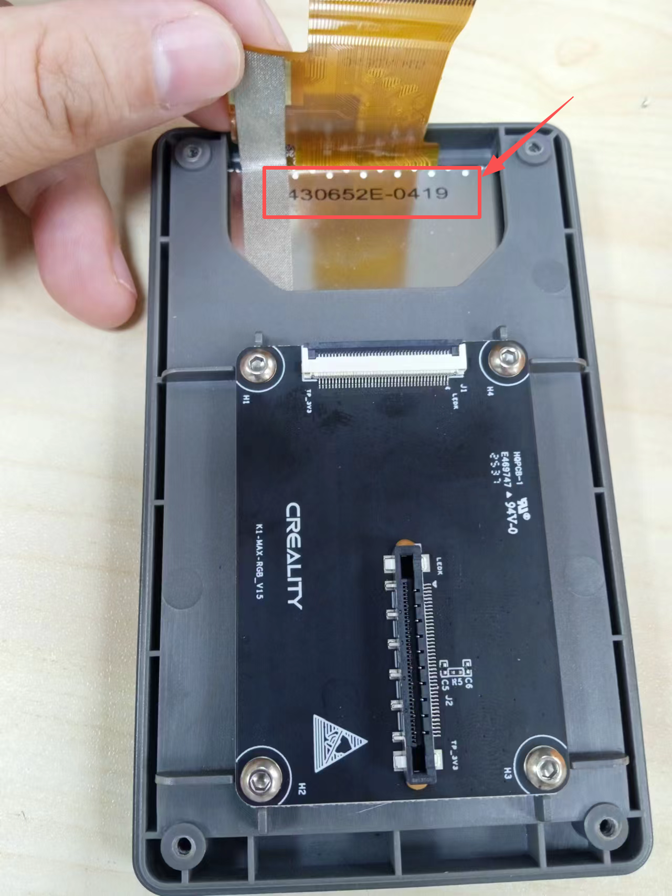

# Catalyst.K Screen

# Introduction
Referring to the Catalyst.K connection diagram, the Catalyst.K Screen is an adapter board positioned between the Raspberry Pi's HDMI port and the original Creality RGB screen.

Once the connections are completed according to the wiring diagram and the Raspberry Pi is configured following the instructions in the "Config" directory, the original display will function correctly.

# Important
If your RGB screen displays the same image as shown below, this version of the screen adapter board is not compatible.

  

  

