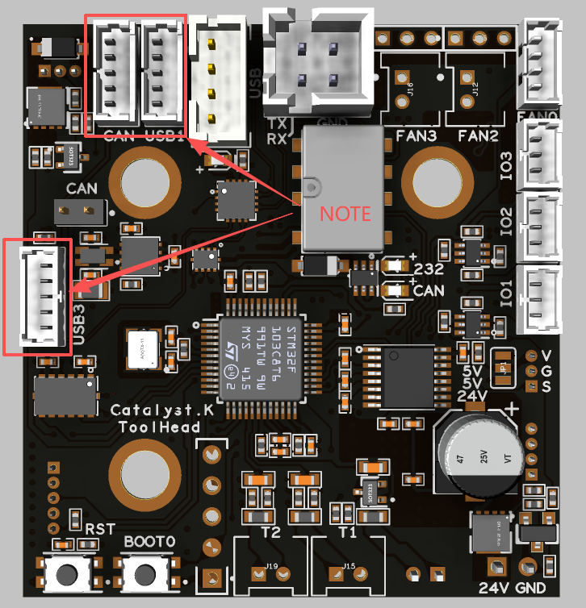
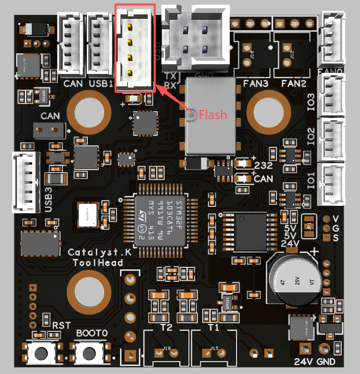
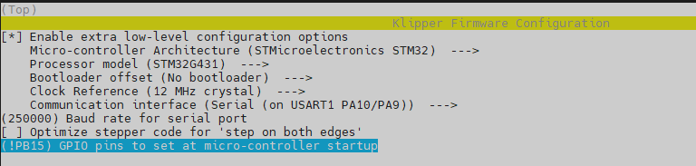
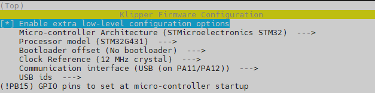
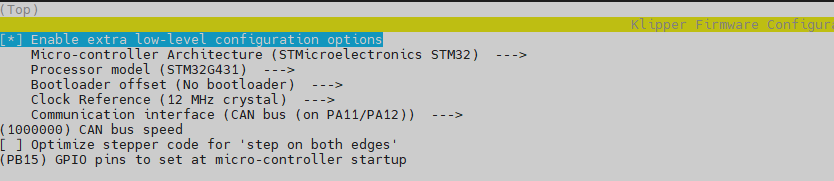
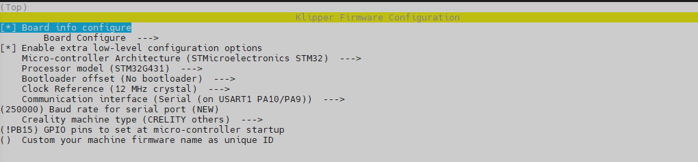
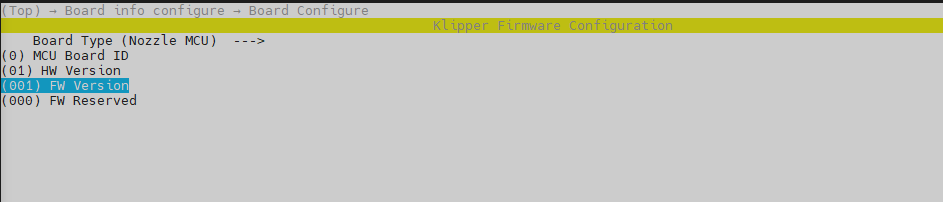
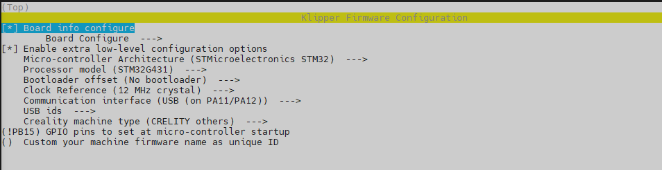
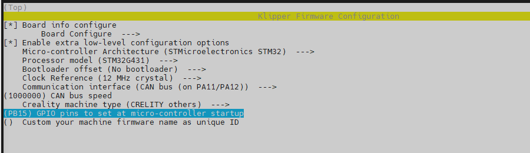

# Catalyst.K Toolhead
# Introduction
The Catalyst.K Toolhead is a circuit board for extruders. 

# Connection
For connection instructions, please refer to the kit connection diagram. When connecting to other external circuit boards using the following interfaces, please verify that the pinout on the board's backplane matches that of the external circuit board being connected.
<p align="center">
  
</p>

# Firmware compilation and upload
## Connection
A professional USB cable is included in the kit; connecting the Raspberry Pi to the Catalyst.KToolhead with it enables firmware uploading. Do not use other USB cables unless you have verified that their pinout matches that of the provided cable.
<p align="center">
  
</p>

## Firmware Configuration
### General Klipper
#### Serial
<p align="center">
  
</p>

#### USB
<p align="center">
  
</p>

#### Can
<p align="center">
  
</p>


### K1_Series_Klipper
#### Serial
<p align="center">
  
</p>

<p align="center">
  
</p>


#### USB
<p align="center">
  
</p>

#### Can
<p align="center">
  
</p>

# Firmware Upload
Use the following commands to compile and upload the firmware.
```
cd ~/klipper
make flash FLASH_DEVICE=0483:df11
```