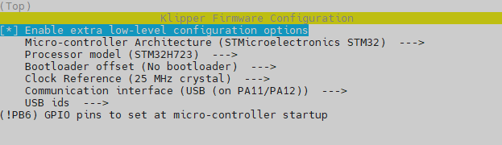
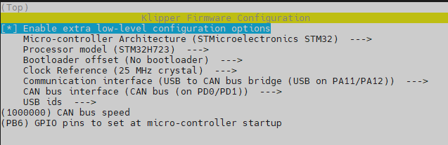
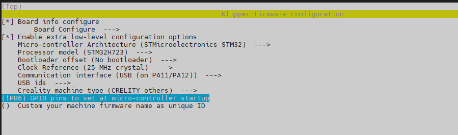
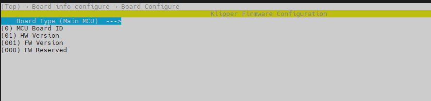
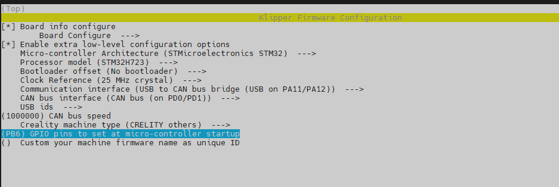

# Catalyst.K
# Introduction
Catalyst.K is the main circuit board installed at the bottom of the machine. For connection instructions, please refer to the kit connection diagram.

# Firmware compilation and upload
## Firmware Configuration
### General Klipper
#### Serial and USB
<p align="left">
  
</p>

#### Can
<p align="left">
  
</p>

### K1_Series_Klipper
#### Serial and USB
<p align="left">
  
</p>

<p align="left">
  
</p>

#### Can
<p align="left">
  
</p>

# Firmware Upload
Use the following commands to compile and upload the firmware.
```
cd ~/klipper
make flash FLASH_DEVICE=0483:df11
```